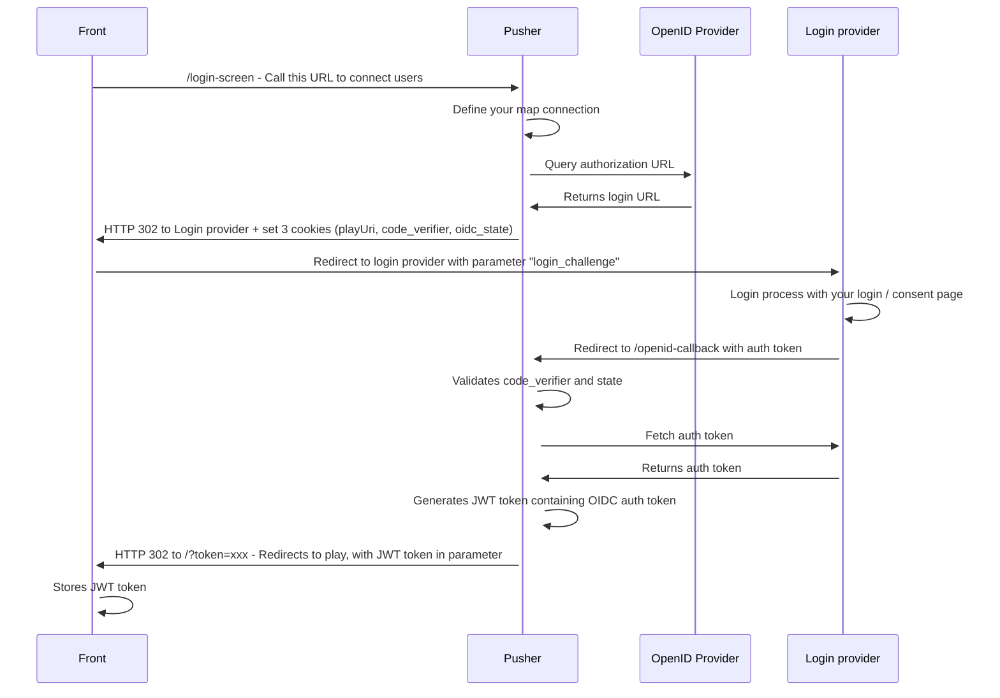
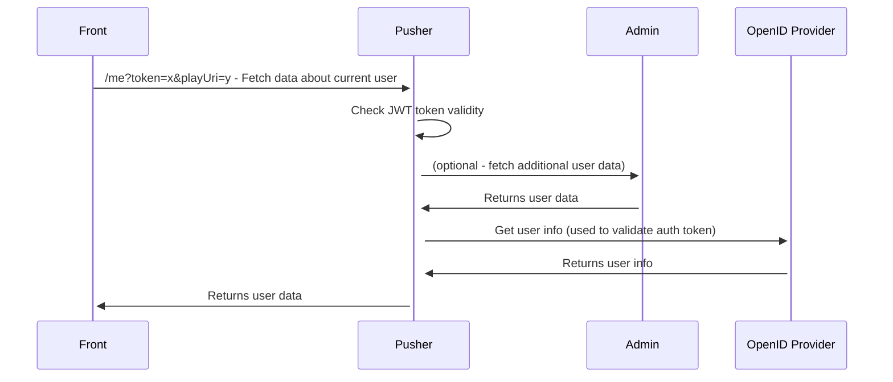

# OpenID connect

WorkAdventure can be connected to any OpenID Connect compliant provider.

It uses the Authorization Code flow and supports PKCE.

To configure WorkAdventure with your OpenID Connect provider, you first need to declare
WorkAdventure as an application in your OpenID Connect provider.

The way you do this depends on the provider.

As part of this configuration, you will need to configure the "redirect URL".

For WorkAdventure, the redirect URL is: `https://play.[your-domain]/openid-callback`.

Then, you need to configure these environment variables:

- `OPENID_CLIENT_ISSUER` (*play container*): the full URL to your OpenID Connect provider
- `OPENID_CLIENT_ID` (*play container*): the ID of the OpenID client that you created in the OpenID Connect provider
- `OPENID_CLIENT_SECRET` (*play container*): the secret of the OpenID client that you created in the OpenID Connect provider
- `OPENID_PROMPT` (*play container*): whether the Authorization Server prompts the End-User for reauthentication and consent. Used as the [`prompt` parameter of the authentication request](https://openid.net/specs/openid-connect-core-1_0.html#AuthRequest) (Default: empty)

There are additional environment variables which can be used to configure the OpenID login process further:
- `OPENID_USERNAME_CLAIM` (*play container*): the claim attribute to be used as the username on login. (Default: username)
- `OPENID_LOCALE_CLAIM`: (*play container*): the claim attribute to use used as the locale on login. (Default: locale)
- `OPENID_SCOPE`: (*play container*): the OpenID scope identifiers to use (Default: openid email profile)

## Restricting login to a Google Workspace organization

If your OpenID provider is **Google** (`OPENID_CLIENT_ISSUER=https://accounts.google.com`), you can restrict
login to accounts that belong to specific Google Workspace organizations, instead of allowing any Google
account.

Set `ALLOWED_GOOGLE_WORKSPACE_DOMAINS` (*play container*) to a comma-separated list of hosted domains, e.g.:

```
ALLOWED_GOOGLE_WORKSPACE_DOMAINS=example.com,example.co.jp
```

- Leave it unset (the default) to disable this restriction entirely — any authenticated Google account is
  allowed, and anonymous / `ADMIN_API_URL` login flows are never affected by this setting either way.
- Once set, an account is allowed only if Google's ID token `hd` (hosted domain) claim is in the list *and*
  the account's email domain matches that `hd` claim. Personal Gmail accounts (no `hd` claim at all) and
  accounts from other domains are denied.
- **This only works with Google as the OpenID provider.** Because `hd` is a Google-specific claim, setting
  `ALLOWED_GOOGLE_WORKSPACE_DOMAINS` while `OPENID_CLIENT_ISSUER` points at a different OpenID provider
  will deny every login — the pusher container logs a startup warning if it detects this misconfiguration.
- A denied login gets a plain `403` response from `/openid-callback` with an explanatory message.
- Membership is re-checked against the *current* value of `ALLOWED_GOOGLE_WORKSPACE_DOMAINS` — not just
  what it was at login time — both on the periodic `/me` reconnect call and on every WebSocket
  reconnection to a room. This means narrowing the list takes effect for existing sessions without
  waiting for their JWT (valid 30 days) to expire. It does **not** detect a Workspace admin suspending or
  removing an individual account mid-session on Google's side; that would require re-fetching a fresh ID
  token via an OAuth refresh token, which isn't implemented.

### Audit log

Every login attempt and every reconnect re-check is written to the pusher container's stdout as one JSON
line, so it can be picked up by whatever log aggregation you already use:

```json
{"event":"google_workspace_auth_attempt","result":"denied","domain":"other-company.com","subject":"user@other-company.com","timestamp":"2026-08-08T12:00:00.000Z"}
```

- `result`: `"allowed"` or `"denied"`.
- `domain`: the `hd` claim presented (or `null` if there was none, e.g. a personal Gmail account).
- `subject`: the same identifier used elsewhere for this user (their email, or their Google `sub` if no
  email was returned) — the same value across a login and a later reconnect denial for the same session,
  so the two can be correlated.
- Successful reconnects are **not** logged on every check (only the initial login, and any reconnect that
  transitions to `denied`) to avoid flooding the log with a line per heartbeat.

## Complete flow

For developers, here is the complete flow:

**Login diagram**


**Page loading diagram**

